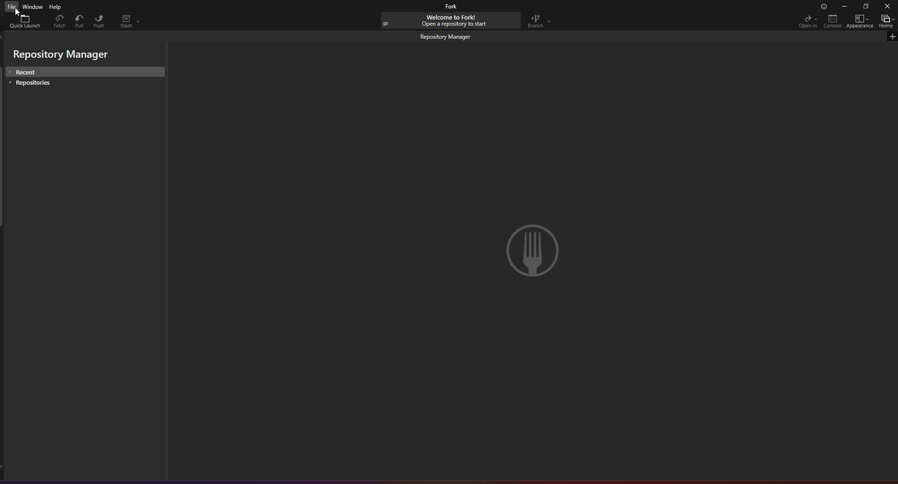

# Comment utiliser git

## Qu'est ce que git ?

Git c'est un [logiciel de versioning](https://fr.wikipedia.org/wiki/Logiciel_de_gestion_de_versions), il permet de gérer l'historique de son projet en sauvegardant des `snapshot` de l'état du projet. Git suit une [gestion de versions décentralisée](https://fr.wikipedia.org/wiki/Gestion_de_versions#Gestion_de_versions_d%C3%A9centralis%C3%A9e), c'est à dire que chaque instances du projets git sur chaque machine est dissociée les une des autres, on va explorer ça plus en détail dans le chapitre concernant Github, pour l'instant on va s'intéresser à comment utiliser git.

## Comment fonctionne git ? 

Git est un logiciel en ligne de commande, c'est à dire que pour gérer votre repo git vous devez utiliser un [terminal de commande](https://fr.wikipedia.org/wiki/Interface_en_ligne_de_commande), mais pas d'inquiétude il existe des interface graphique permettant de faire le pont entre vous et les commandes à éxécuter. Celui que je recommande est [Fork](https://git-fork.com/), je l'utilise depuis ~5 ans donc je pourrai vous aider si vous avez des soucis avec. L'exemple qui suit utilisera fork, je recommande de le suivra pas à pas en faisant les manipulation pour bien comprendre ce qu'il se passe. Si vous avez des problèmes pendant, hésitez pas à me soliciter.

### Création de son premier repo git

Avec git un projet est nommé un "dépôt" en Français, mais je vais utiliser la terminologie d'origine "repository" racourcie en repo. On va procéder à la création de notre premier repo, pour ça il faut tout d'abord créer un dossier sur votre PC où vous le souhaitez : 

Ensuite on va ouvrir Fork, et cliquer sur `File > Init new repository` dans le menu du haut, cela va ouvrir un explorateur de fichier il faudra allez sélectionner le dossier que vous avez créé précédemment : 

Et voilà, le projet est créé. Ca peut sembler abstrait, donc pour les curieux voici ce que fais exactement fork et git dans cette histoire. Fork ici ne fait qu'éxécuter une commande git : `git init`, et cette commande va concrêtement créer les fichiers nécessaire à git pour gérer le repo. Tout les fichiers relatif au projet git est localisé dans un dossier `.git/` à la racine de votre repo : 

Vous n'avez pas à connaître le détail de ces fichiers, mais c'est bon de garder à l'esprit qu'un repo git contient **TOUJOURS** un dossier .git/ à sa racine. Si ce dernier n'est pas présent ça veut dire que le dossier que vous examinez n'est pas un repo git. C'est dans ce dossier que git enregistre toutes les infos du repo, y compris l'historique des modification donc je conseil à quiconque qui n'est pas sûr de ce qu'il fait de ne jamais toucher manuellement au dossier git. 

### On a notre repo, et maintenant ?

Maintenant qu'on a notre repo de prêt, on peut commencer à utiliser git. Pour commencer on va créer un fichier `toto.txt` avec le contenu de votre choix dans le dossier de votre projet. Une fois cela fait, si vous retournez sur Fork vous devriez voir quelque chose qui à changé, sur la droite de l'interface vous devriez avoir un text `Local changes (1)`, si vous cliquez dessus vous allez naviguer vers une nouvelle page : 

 

Dans la zone **A** on voit notre super fichier `toto.txt`, cette zone liste les modifications qui ont été faites au projet et qui ne sont pas encore enregistré par git. En l'occurence on constate bien qu'il a observé la création de notre fichier. 

Si on sélectionne notre fichier `toto.txt` dans la zone A, dans la zone C on peut constater une affichage enrichi du contenu de notre fichier. Plus précisement ici sera listé tout les changements que vous avez effectué sur le fichier sélectionné.

Toujours avec notre fichier sélectionné, si on clique sur `Stage` (en haut à droite de la zone) on observe notre fichier se déplacer de Unstaged (zone A) à Staged (zone B). En faisant on dit à git qu'on veut enregistrer la modification (création du fichier toto.txt) pour notre prochain commit. Après avoir passé `toto.txt` dans la zone `Staged` on renseigner un nom de commit dans le champ `Commit object` pour l'exemple on va renseigner `Ajout de toto.txt`. Une fois le champ rempli on cliquer sur `Commit` en bas à droite et voilà ! Pour constater la génialité de ce qu'on vient de faire on doit retourner sur la page précédente, pour se faire cliquez sur `All Commits` à gauche, vous devriez avoir ce qui suit : 

Voilà notre super commit qui est affiché ! 

### Mais c'est quoi un commit ? 

Pour comprendre ce qu'on vient de faire, on doit explorer un peu plus le fonctionnement de git. On sait que git sauvegarde l'historique de notre projet en une succession de `snapshot`. Une `snapshot` correspond à l'état de notre projet à un instant T. L'opération effectué dans le chapitre précédent peut se traduire : *"dire à git d'enregistrer l'état des fichiers qu'on lui donne dans l'historique"*. On peut constater ça en cliquant sur `File Tree` avec notre commit sélectionné : 

*On observe ici notre fichier toto.txt solitaire à la racine du projet*

Mais un commit n'est pas seulement une `snapshot` de l'état de notre projet. Il contient aussi des méta-données qui servent à git à identifier notre commit et sa relation avec les autres commits. Voyons ça en retournant sur l'onglet `Commit` :

On voit en premier l'auteur du commit avec un nom et un email  \*. Ensuite un champ `refs` avec renseigné la valeur `master`, cette information n'est pas réellement propre au commit et nous est pas utile dans l'immédiat donc on va l'ignorer. 

Les deux champs suivant cependant sont importants : 
- SHA : c'est l'identifiant unique de notre commit. Tout commit en possède un, et aucun commit peut posséder un SHA identique à un autre. Dans mon cas c'est `151743839e22c1faf1db71bbd963202c606e4512` mais le votre sera différent. 
- Parents : c'est l'identifiant du papa de notre commit, c'est à dire d'où il part, dans notre cas ce champ est vide car le commit qu'on observe est le tout premier de notre arborescence.

Pour étudier la relation entre les commits je vous invite à reproduire les étapes nécessaire pour faire un nouveau commit. Pour ça il faudra créer un nouveau fichier, éditer `toto.txt` ou même le supprimer, puis retourner dans `Local changes` pour passer les modification en `Staged`, renseigner un titre à votre nouveau commit et appuyer sur `Commit`. Pour ma part j'ai décidé d'ajouter "Longue vie à TrashBoatStudio" dans `toto.txt` et j'ai ajouté notre super logo : 

  

Maintenant qu'on a notre nouveau commit on voit le champ `Parents` rempli, avec une version racourcis de notre commit précédent `1517438` (différent chez vous). Cela veut dire que notre nouveau commit part de notre premier et le commit qui suivra aura pour parent notre nouveau et ainsi de suite. Avec ça on peut déjà modifier notre projet et en avoir un historique de chaque version. Génial, n'est ce pas ? Mais c'est pas tout ! 

\* *Ces informations sont renseigné dans vos préférences git, pour les modifier vous pouvez aller dans `File > Preferences` puis l'onglet `Git`.*

### Mais c'est pas tout ?!

Eh non ! Je vais introduire ça avec un problème, imaginons qu'une personne A fasse des modifications sur le projet en même temps qu'une personne B. Tout les deux en démarrant leurs modifications à partir du même commit `15d54fa` : 

Et qu'ensuite C arrive après la guerre et veut ajouter ses modifications. Quel commit parent est-ce qu'il va choisir ? Eh bien, il n'y a pas de bonne réponse, si il choisi le dernier commit de A il n'aura pas les modifications de B et inversement. Pour résoudre ce soucis, on va introduire le concept de `branch` et de `merge` dans git. 

Une branche dans git, c'est un label, ce label est positionné sur un commit et représentera la tête de cette branche. Si vous vous souvenez de la page Fork avec la liste des commit il y avait un petit badge `master` à côté du dernier commit, c'est pour dire que la branche `master` est à ce commit. La branche `master` ou `main` d'un repo git c'est quasi-toujours la branche par défaut et par convention celle qui doit représenter le dernier état stable du projet. Maintenant, comment les branches nous aident avec notre problème ? C'est parce que cela va permettre de pouvoir mettre un nom sur différents morceaux de commit partant d'un commit commun. Pour faire plus simple voilà déjà ce que donnerai notre graphe du dessus avec des branche clairement définie : 

*Pour les observateur, ici la branche dont part les deux autres s'appelle `dev` et non `main` ou `master`. C'est parce que la branche `dev` représente le projet dans son état de "chantier" et c'est toujours de cette branche que doit partir toute modifications, mais on verra ça plus en détail dans la joyeuserie des convebtions d'utilisation*

Bon ça paie peut être pas de mine comme ça, mais notre arbre est déjà bien plus compréhensible. On sait que A à fait une branche ou il a ajouté les sons du monstre et que B de même mais pour les images du monstre. Mais ça ne change que quand C arrive il ne sait toujours pas d'où partir. Ce choix est en fait très simple, car la réponse sera quasi-toujours à partir de `dev` ! Si vous vous sentez arnaqué, c'est normal. Pour tout comprendre il faut introduire la notion de `merge`. 

Le `merge` est le procédé de fusionner une branche dans une autre. Concrètement le merge de la branche B dans A correspond à appliquer tout le commit de B sur A. Dans notre cas, on peut imaginer que A ait fini de faire ses modifications il veut donc ajouter son travail au socle commun : la branche `dev`. Pour faire ça il va voulloir merge `art/addMonsterSound` à dev. Dans ce process, par convention, la branche de A sera supprimé dans le process car il n'y aura plus de raison d'indexer ces commits étant donné qu'ils seront compris dans `dev`. Lors d'un merge, toujours par convention, un commit de merge sera créé. J'ai fais une reproduction du schéma dans le projet créé précédement :

*Le commit de merge va contenir l'ensemble des modifications apportées par `art/addMonsterSound` et va être parenté au dernier commit de `dev`, et voilà ! Nos travaux sont intégré au socle commun*

Ainsi pour travailler en parallèle chacun peut créer une branche à partir de `dev` et la merge une fois les travaux finalisé et validé. Cela permet de garder un socle commun clair. Ici le problème est simple donc omet une partie assez importante des merge : les conflits. On n'entrera pas dans les détails ici, mais visualisez un scénario ou A et B partent de `dev` et modifient tout les deux le même fichier. Le premier qui va merge sa branche dans `dev` n'aura pas de soucis, cepandant le second aura un problème, car sur `dev` une version plus récente du fichier est présente donc git ne peut pas simplement rajouté ses modifications par dessus\*. Pour répondre à cette problématique il n'y a pas de solution universelle mais le plus souvent cela passe par une bonne organisation de l'équipe à travailler en collaboration avec git. 

A noter que les conflits de merge sont sans doute la source numéro 1 des soucis que les utilisateurs de git rencontre. Certains cas peuvent être complexe et ça vient avec le temps, donc pour tout soucis dont vous êtes pas sûr vous pouvez me soliciter.

\* *parfois il pourra sur les fichiers textuels, grâce à son algorithme de différence entre fichier qui peut permettre une fusion automatique si ce sont différentes lignes du fichier qui sont modifiés*

### Conclusion

Maintenant on sait parfaitement  comment fonctionne git pour versionner notre projet (n'est ce pas ?). Mais pour l'instant tout ce que nous avons fait est stocké sur notre machine, pas très pratique pour que les autres puissent y accéder. Pour répondre à ce soucis, le prochain chapitre parler de Github et comment utiliser git pour la collaboration distante.

## Git et Github, quelles différences ?

Git et Github sont, par abus de langage, parfois interchangé alors que ce sont deux entités bien différentes. On sait déjà ce qu'est git, et pour introduire Github voici le schéma suivant : 

Sur votre PC vous avez le logiciel git et le projet Crawlerino. Github est (grosso-merdo) un cloud sur lequel on peut héberger un repo git, en l'occurence notre projet sur github est [Rikougo/Crawlerino](https://github.com/Rikougo/Crawlerino). Github va nous permettre de partager et recevoir les modifications effectuées par chacun sur leurs machines. On va voir comment vous pouvez descendre le repo git de Crawlerino sur votre machine et comment envoyer vos modifications. Tout d'abord, nous allons avoir besoin de configurer nos clef SSH. Kézaco ? Les clef SSH sont en fait des chaîne de caractère unique que vous allez générer, ces clefs sont utilisées lors d'échange de données avec git pour chiffrer vos communications. Si ça vous intéresse je pourra détailler cette partie, mais pour l'instant pas besoin de comprendre on va utiliser notre outil favoris : Fork !

Si vous allez dans le menu `File > Configure SSH Keys` la fenêtre suivante va apparaître : 

Peut être que vous n'avez aucune clef, donc pour cliquer sur le petit `+`. Cela va ouvrir une fenêtre, dans nom vous pouvez mettre `fork_ssh_key` et dans email je vous conseil de mettre `votre_pseudo@NOMDEVOTREPC` (où NOMDEVOTREPC correspond au nom affiché quand vous faites `clique droit sur le logo Windows de la barre de tâche > Système` dans le champ `Nom de l'appareil`, ça permet de facilement identifier à quel ordinateur la clef appartient). Une fois la clef créée elle devrait apparaître dans la liste, et si vous la sélectionnez vous voyez votre clef publique. Il va falloir enregistrer cette clef dans votre compte Github. Je reprends les étapes partagés dans [la doc github](https://docs.github.com/fr/authentication/connecting-to-github-with-ssh/adding-a-new-ssh-key-to-your-github-account#adding-a-new-ssh-key-to-your-account) :

- Dans le coin supérieur droit de n’importe quelle page sur GitHub, cliquez sur votre photo de profil, puis sur Paramètres

- Dans la section « Accès » de la barre latérale, cliquez sur Clés SSH et GPG.

- Cliquez sur Nouvelle clé SSH ou Ajouter une clé SSH.

- Dans le champ « Titre », ajoutez une étiquette descriptive pour la nouvelle clé. Par exemple, si vous utilisez un ordinateur portable personnel, vous pouvez nommer cette clé « Ordinateur portable personnel ».

- Sélectionnez le type de clé : authentification ou signature. Pour plus d’informations sur la signature de commit, consultez À propos de la vérification des signatures de commit.

- Dans le champ « Clé », collez votre clé publique.

- Cliquez sur Ajouter une clé SSH.

- Si vous y êtes invité, confirmez l’accès à votre compte dans GitHub. Pour plus d’informations, consultez « Mode sudo ».

Youpi la clef SSH est configuré ! Maintenant vous allez pouvoir récupérer le projet, pour ce faire rendez vous sur https://github.com/Rikougo/Crawlerino et vous pourrez l'URL du projet qu'il nous faut comme ceci : 

*mais je suis sympa, la voilà `git@github.com:Rikougo/Crawlerino.git`*

A partir de cette URL, dans Fork nous allons récupérer le projet hebergé sur git. Pour se faire ouvrez l'outil `File > Clone ...` : 

Remplissez l'url, effectuez un test de connexion. Si celui-ci echoue contactez moi et on verra ça ensemble. Si le test réussi vous pouvez ensuite sélectionner dans quel dossier stocker le projet. Une fois fais, appuyez sur `Clone`, ca va fermer la popup et vous pouvez voir Fork mouliner en haut. Une fois finit vous devriez avoir le résultat suivant : 

Et à partir de là normalement vous devriez pouvoir ajouter ce que vous voulez au projet. Toujours en partant de `dev`. 